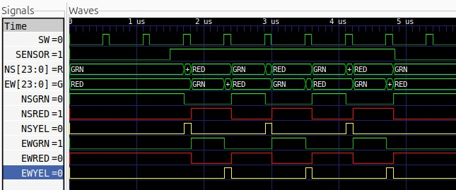

# Traffic Light Controller

A simple, glitch-free traffic light controller written in **structural SystemVerilog**.
Two sequential blocks cooperate on a shared clock:

- a **modulo-60 timing counter** that produces the internal `SW` strobe
- a **5-state Moore FSM** that drives the six traffic lights

The design guarantees a full 50/10 second green/yellow interval for every direction
and ensures that the yellow period is **never** shortened, even if `SENSOR` changes
mid-pulse.


---

## Features

- 50-cycle green / 10-cycle yellow timing driven by a free-running modulo-60 counter
- Sensor-based priority: north–south stays green until a car is waiting east–west
- One lamp per direction at all times (no glitches — Moore output)
- Two distinct NS-green states so yellow can only be entered at the **start** of an
  `SW`-high pulse, guaranteeing the full 10-cycle yellow duration
- Self-checking testbench with 4 stimulus phases and decoded colour buses

---

## Design at a Glance

```
              +-----------+      +-----------------+
   CK  -----> |  timing   | SW   |    signal       |--> NSGRN, NSYEL, NSRED
              |  counter  |----->|    generator    |--> EWGRN, EWYEL, EWRED
              +-----------+      +-----------------+
                                  ^
                                  |
                              SENSOR
```

### State diagram

```
        +------+   SW=1,SEN=0   +------+
        | NSG0 | -------------> | NSG1 |   (absorb full SW-high pulse)
        +------+                +------+
            |   SW=1,SEN=1          |  SW=0
            v                       v
        +------+   SW=0         +------+
        | NSY  | -------------> | EWG  |
        +------+                +------+
            |   SW=1               |  SW=1
            |                      v
            |                  +------+
            |  SW=1            | EWY  |
            +----------------- +------+
                                  |  SW=0
                                  v
                                NSG0
```

The split between `NSG0` and `NSG1` is the key design decision: `SENSOR` is only
sampled while in `NSG0` (i.e. while `SW=0`), and the transition into yellow is
qualified by `SW=1`. Together these rules force yellow to always start at the
rising edge of `SW` and last exactly 10 cycles.

---

## File Structure

```
.
├── timing_counter.sv    # mod-60 counter, generates SW
├── signal_generator.sv  # 5-state Moore FSM, drives the six lights
├── traffic_controller.sv # top-level, wires the two blocks
├── traffic_tb.sv        # testbench with 4-phase stimulus
└── README.md
```

---

## Signal Reference

| Signal  | Type     | Description                                        |
|---------|----------|----------------------------------------------------|
| `CK`     | input    | System clock (nominally 1 Hz in spec, 10 ns in sim) |
| `SENSOR` | input    | Asserted while a car waits at the EW red light     |
| `SW`     | internal | Low for 50 cycles, high for 10 cycles              |
| `NSGRN`  | output   | North–south green                                  |
| `NSYEL`  | output   | North–south yellow                                 |
| `NSRED`  | output   | North–south red                                    |
| `EWGRN`  | output   | East–west green                                    |
| `EWYEL`  | output   | East–west yellow                                   |
| `EWRED`  | output   | East–west red                                      |

---

## Simulation

### Icarus Verilog

```bash
iverilog -g2012 -o sim.vvp traffic_tb.sv traffic_controller.sv \
                           timing_counter.sv signal_generator.sv
vvp sim.vvp
gtkwave dump.vcd &
```

### ModelSim / Questa

```bash
vlog -sv traffic_tb.sv traffic_controller.sv \
                timing_counter.sv signal_generator.sv
vsim -c work.traffic_tb -do "run -all; quit"
```

---

## Testbench

The testbench runs four stimulus phases to exercise every interesting path:

| Phase | `SENSOR` | What it verifies                                          |
|-------|----------|-----------------------------------------------------------|
| 1     | `0`      | NS stays green indefinitely while no car is waiting       |
| 2     | `0→1`    | Normal alternating sequence once a car is waiting         |
| 3     | `1→0`    | Controller stalls again after the sensor is dropped       |
| 4     | `0→1`    | Sensor asserted **mid-pulse** does **not** shorten yellow |

A `$monitor` task prints the decoded `NS` / `EW` colour strings to the console,
and a VCD dump is written for waveform inspection.



---
